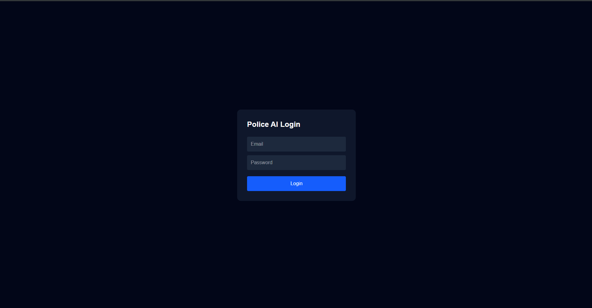
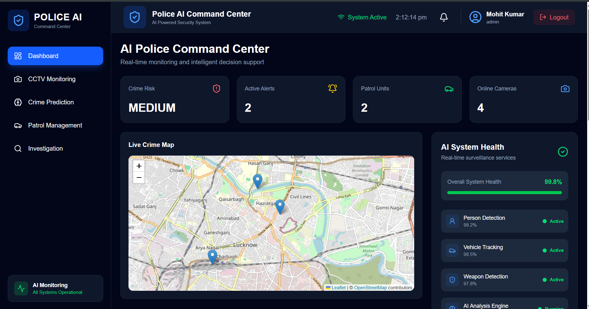
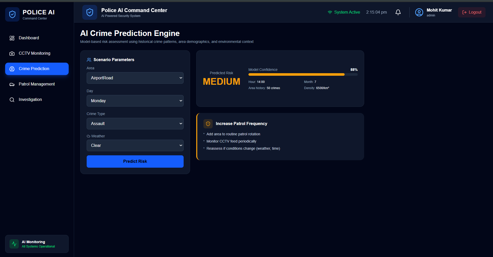
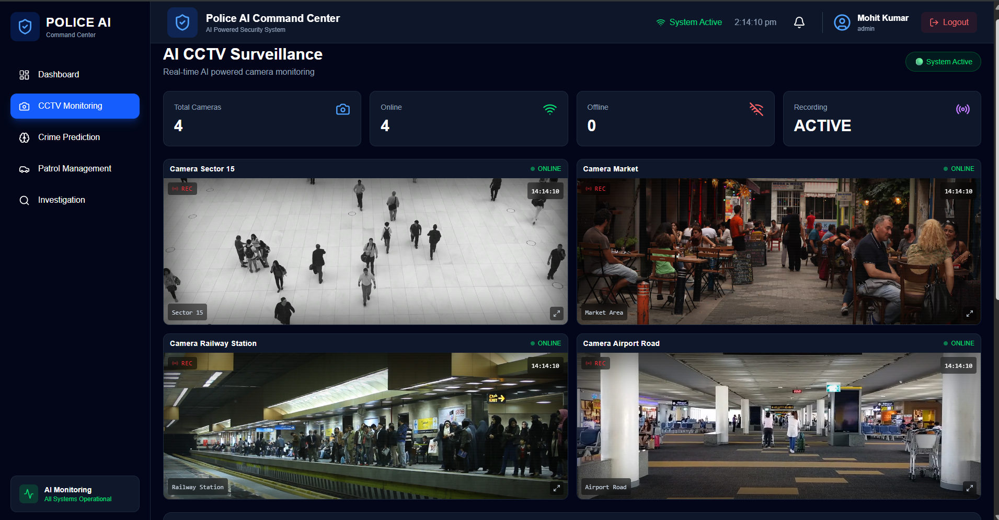
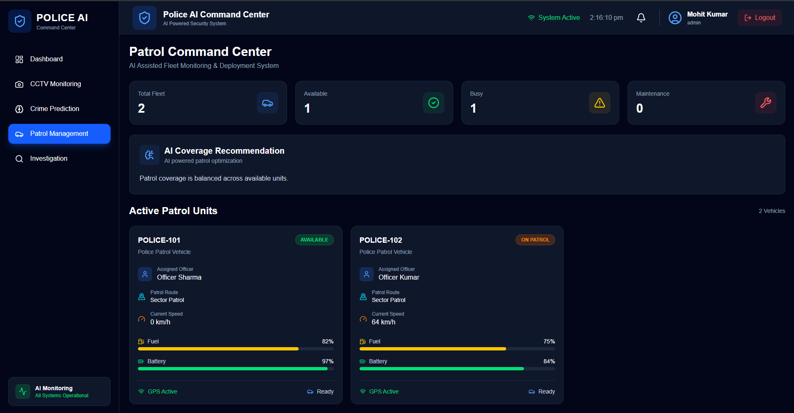
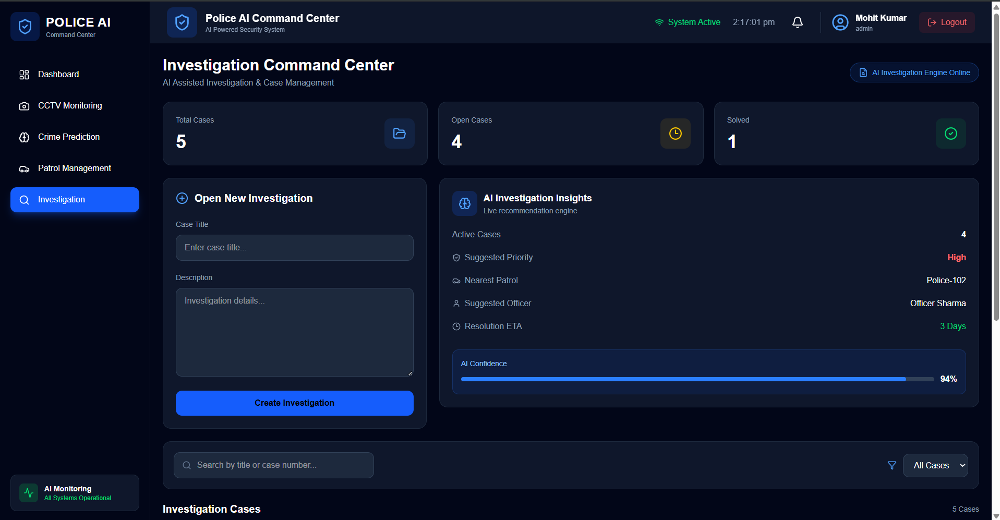

<div align="center">

# 🚔 Police AI Command Center

### An AI-Powered Police Surveillance, Prediction & Case Management Platform

A full-stack command center that unifies **real-time CCTV monitoring**, **machine learning-based crime risk prediction**, **live socket-driven alerting**, **patrol fleet management**, and **digital investigation case tracking** into a single operational dashboard.

[](https://react.dev/)
[](https://nodejs.org/)
[](https://www.mongodb.com/)
[](https://fastapi.tiangolo.com/)
[](https://scikit-learn.org/)
[](https://socket.io/)
[](https://tailwindcss.com/)
[](LICENSE)

[Live Demo](#) · [Report Bug](#) · [Request Feature](#)

</div>

---

## 📖 Table of Contents

- [Overview](#-overview)
- [Screenshots](#-screenshots)
- [Key Features](#-key-features)
- [Tech Stack](#️-tech-stack)
- [Folder Structure](#-folder-structure)
- [API Overview](#-api-overview)
- [Getting Started](#️-getting-started)
- [Machine Learning Model](#-machine-learning-model)
- [Security Practices](#-security-practices-implemented)
- [Deployment](#-deployment)
- [Topics & Concepts Covered](#-topics--concepts-covered)
- [Future Improvements](#-future-improvements)
- [Author](#-author)
- [License](#-license)

---

## 🧠 Overview

**Police AI Command Center** is a centralized control-room application built to demonstrate how AI, real-time systems, and traditional full-stack engineering come together to solve a real-world operational problem: giving officers and administrators a single pane of glass to monitor, predict, respond to, and document incidents.

The system lets a user:

- 🎥 Monitor live CCTV feeds across multiple zones from one dashboard
- 🤖 Predict crime risk for a given area, time, and environmental context using a trained ML model
- 🚨 Receive real-time alerts pushed instantly to every connected dashboard the moment risk is detected
- 🚓 Track, assign, and dispatch patrol vehicles across the city
- 🕵️ Create, update, and manage full investigation case files with evidence logs and status timelines
- 📊 Visualize city-wide crime trends on an interactive map and analytics chart

The project is deliberately split into **three independently deployable services** — a React frontend, a Node/Express API, and a Python/FastAPI ML microservice — to reflect how real production systems separate business logic from machine learning inference.

---

## 📸 Screenshots

> _Add your screenshots to a `/screenshots` folder in the repo root — the paths below already match._

<table>
<tr>
<td align="center"><b>Login</b></td>
<td align="center"><b>Dashboard</b></td>
</tr>
<tr>
<td></td>
<td></td>
</tr>
<tr>
<td align="center"><b>AI Crime Prediction</b></td>
<td align="center"><b>CCTV Monitoring</b></td>
</tr>
<tr>
<td></td>
<td></td>
</tr>
<tr>
<td align="center"><b>Patrol Management</b></td>
<td align="center"><b>Investigation Center</b></td>
</tr>
<tr>
<td></td>
<td></td>
</tr>
</table>

---

## ✨ Key Features

| Feature | Description |
|---|---|
| 🔐 **Secure Authentication** | JWT-based auth with bcrypt-hashed passwords, protected routes on both client and server |
| 🧭 **Live Command Dashboard** | Real-time stats, crime analytics chart, interactive crime map, active alert feed, fleet overview |
| 🎥 **CCTV Monitoring** | Multi-camera live video grid with per-camera online/offline status and fullscreen mode |
| 🤖 **AI Crime Risk Prediction** | Random Forest model predicts risk level (LOW / MEDIUM / HIGH) with confidence score and an actionable recommendation panel |
| 🚨 **Real-Time Alerting** | Socket.io pushes high-risk predictions instantly to every connected client with a live notification badge |
| 🚓 **Patrol Fleet Management** | Vehicle assignment, live status tracking, AI-based coverage recommendations |
| 🕵️ **Investigation Workspace** | Full case lifecycle: create, add evidence, update status, and track a visual timeline per case |
| 📊 **Crime Analytics** | Month-wise crime trend charts and geolocated crime mapping via Leaflet |

---

## 🛠️ Tech Stack

**Frontend**
`React 19` · `Vite` · `Tailwind CSS 4` · `React Router v7` · `Axios` · `Socket.io Client` · `Recharts` · `React-Leaflet` · `Lucide Icons`

**Backend**
`Node.js` · `Express 5` · `MongoDB + Mongoose` · `Socket.io` · `JWT` · `bcrypt`

**AI / ML Engine**
`Python 3.10` · `FastAPI` · `Pydantic` · `scikit-learn` · `pandas` · `numpy` · `joblib`

**Database & Infra**
`MongoDB Atlas`

---

## 📂 Folder Structure

```
PoliceAI-Command-Center/
├── client/                     # React frontend
│   └── src/
│       ├── components/          # Reusable UI components
│       ├── pages/                # Route-level pages
│       ├── context/               # Auth context (global state)
│       ├── hooks/                  # Custom hooks (useFetch)
│       ├── services/                # Axios instance + socket client
│       └── utils/                    # Constants & helper functions
│
├── server/                     # Node.js / Express backend
│   └── src/
│       ├── config/               # Database connection
│       ├── controllers/           # Route handlers / business logic
│       ├── middleware/             # Auth guard + centralized error handling
│       ├── models/                  # Mongoose schemas
│       ├── routes/                   # API route definitions
│       ├── services/                  # AI service proxy + WebSocket service
│       └── utils/                      # JWT token generator
│
└── ai-engine/                  # Python FastAPI ML microservice
    ├── api/                       # FastAPI app, routes, inference service
    └── crime_prediction/          # Dataset generation, preprocessing, training
        ├── dataset/
        └── models/                  # Trained model + encoders (.pkl)
```

---

## 🔌 API Overview

All backend routes are prefixed with `/api` and — except for auth — require a `Bearer` JWT token in the `Authorization` header.

| Method | Endpoint | Description |
|---|---|---|
| `POST` | `/api/auth/register` | Register a new officer/admin account |
| `POST` | `/api/auth/login` | Login and receive a JWT |
| `GET` | `/api/dashboard` | Aggregated dashboard stats, alerts, vehicles, cameras, crime graph |
| `POST` | `/api/ai/predict-crime` | Get an AI-based crime risk prediction |
| `GET` `POST` | `/api/crime` | List / report crime records |
| `GET` `POST` `PUT` `DELETE` | `/api/alert` | Manage security alerts |
| `GET` `POST` `PUT` `DELETE` | `/api/cctv` | Manage cameras and their status |
| `GET` `POST` `PUT` `DELETE` | `/api/vehicle` | Manage the patrol vehicle fleet |
| `GET` `PUT` | `/api/patrol` | Patrol assignment and active patrol tracking |
| `GET` `POST` `PUT` `DELETE` | `/api/investigation` | Case management + evidence logging |

The AI engine itself exposes:

| Method | Endpoint | Description |
|---|---|---|
| `POST` | `/predict-crime-risk` | Runs the trained model and returns risk level + confidence |
| `GET` | `/docs` | Auto-generated Swagger UI (FastAPI) |

---

## ⚙️ Getting Started

### Prerequisites
- Node.js v18+
- Python 3.10+
- A MongoDB Atlas account (or local MongoDB instance)

### 1. Clone the repository
```bash
git clone https://github.com/<your-username>/PoliceAI-Command-Center.git
cd PoliceAI-Command-Center
```

### 2. Set up the AI Engine
```bash
cd ai-engine
python -m venv venv
venv\Scripts\activate        # Windows
# source venv/bin/activate   # macOS/Linux

cd crime_prediction
pip install -r requirements.txt
python dataset_generator.py
python preprocessing.py
python train.py

cd ../api
pip install -r requirements.txt
uvicorn main:app --reload
```
Runs at `http://127.0.0.1:8000` — visit `/docs` for the interactive Swagger UI.

### 3. Set up the Backend
```bash
cd server
npm install
```

Create a `.env` file in `server/`:
```env
PORT=5000
MONGO_URI=your_mongodb_connection_string
AI_SERVICE_URL=http://127.0.0.1:8000
JWT_SECRET=your_long_random_secret
CLIENT_URL=http://localhost:5173
```

```bash
npm run seed     # optional — populates demo data
npm run dev
```
Runs at `http://localhost:5000`

### 4. Set up the Frontend
```bash
cd client
npm install
```

Create a `.env` file in `client/`:
```env
VITE_API_URL=http://localhost:5000/api
VITE_SOCKET_URL=http://localhost:5000
```

```bash
npm run dev
```
Runs at `http://localhost:5173`

### 5. Try it out
1. Register a new account from the login page
2. Log in and explore the Dashboard
3. Head to **Crime Prediction** and run a live prediction
4. Create a case in **Investigation**, add evidence, and update its status
5. Check out **CCTV Monitoring** and **Patrol Management**

---

## 🤖 Machine Learning Model

The crime risk prediction model is a **Random Forest Classifier** trained on a synthetically generated dataset encoding realistic relationships between:

- Area, day of week, hour, month
- Crime type
- Historical crime count for the area (`previous_crimes`)
- Population density
- Weather conditions

**Pipeline:**
`dataset_generator.py` → `preprocessing.py` (label encoding) → `train.py` (train/test split, model fit, evaluation) → model + encoders persisted with `joblib` and served via FastAPI.

The API validates every incoming categorical value against the encoders the model was trained on, returning a clear `400` response with the exact list of valid values if an unseen category is submitted — instead of silently failing or crashing.

> **Note:** The dataset is synthetically generated for demonstration purposes and does not represent real crime records. In a production deployment, this would be replaced with real, anonymized historical data and retrained on a scheduled basis.

---

## 🔒 Security Practices Implemented

- Passwords hashed with **bcrypt** before storage — never stored in plaintext
- **JWT-based** stateless authentication with token expiry
- Protected API routes via Express middleware (`protect`)
- Protected frontend routes via a `ProtectedRoute` wrapper + Axios interceptor that auto-redirects on token expiry/401
- All secrets managed through environment variables — never committed to version control
- **CORS** restricted to known, explicit frontend origins
- Centralized error-handling middleware to avoid leaking stack traces in production

---

## 🚀 Deployment

| Service | Suggested Platform |
|---|---|
| Frontend (`client`) | Vercel / Netlify |
| Backend (`server`) | Render / Railway |
| AI Engine (`ai-engine/api`) | Render / Railway |
| Database | MongoDB Atlas |

Every service reads its configuration entirely from environment variables, so moving from local development to production requires **zero code changes** — only the environment variable values differ (API URLs, database connection string, JWT secret).

---

## 📚 Topics & Concepts Covered

This project was built to demonstrate practical, interview-ready fluency across the full stack:

**Backend & API Design** — REST API architecture (MVC pattern), JWT authentication & authorization, password hashing, middleware design, centralized error handling, MongoDB aggregation pipelines, environment-based configuration, CORS.

**Real-Time Systems** — WebSocket-based live updates with Socket.io, event-driven architecture, real-time notification systems.

**Frontend Engineering** — React Hooks (state, effects, memoization, refs, context), custom hooks, protected routing, Axios interceptors, controlled forms, component composition, real-time UI synchronization, data visualization, map integration.

**Machine Learning** — Supervised classification, feature encoding, train/test methodology, model evaluation metrics, model serialization & serving, input validation for ML inference APIs.

**System Design** — Microservice separation of concerns (business logic vs. ML inference), inter-service communication, scalable full-stack architecture.

---

## 🔮 Future Improvements

- [ ] Real-time GPS tracking for patrol vehicles instead of static coordinates
- [ ] Role-based access control (admin vs. officer permission levels)
- [ ] Notification center/dropdown for full alert history
- [ ] Replace synthetic training data with real historical crime datasets
- [ ] Automated testing — Jest (backend), React Testing Library (frontend), pytest (AI engine)
- [ ] Dedicated backend support for case priority tracking
- [ ] Containerize all three services with Docker for simplified deployment

---

## 👤 Author

**[Your Name]**

[LinkedIn](#) · [GitHub](#) · [Email](#)

---

## 📄 License

This project is licensed under the [MIT License](LICENSE).

<div align="center">

⭐ If you found this project useful, consider giving it a star on GitHub!

</div>